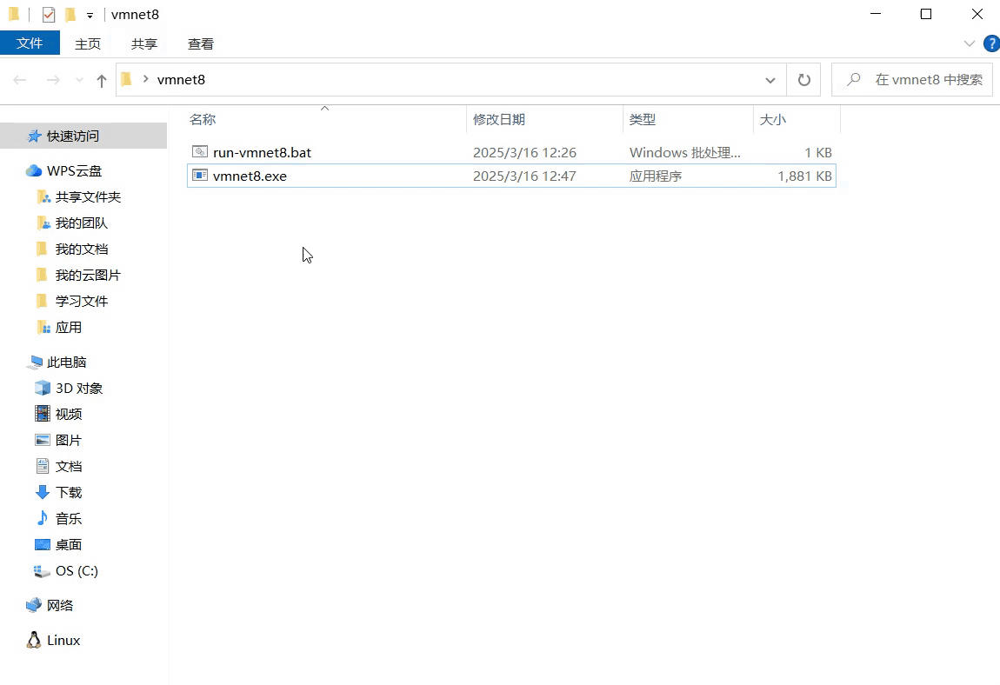

# VMnet8_controller
在Windows系统中，在经常使用到VM虚拟机与本地的SSH工具时，需要手动去开启网络适配器中的VMware Network Adapter VMnet8 （控制面板\所有控制面板项\网络连接），相对比较麻烦，这里提供了一套相对便捷的一键启动方案。



使用C++编写的VMnet8网络适配器自动开关程序，已编译为exe二进制文件，您仅需要下载该应用压缩包[（点击下载）](https://github.com/QiPanTanYi/VMnet8_controller/releases/tag/vmnet8)，将该压缩包解压到本地中（推荐解压到本地桌面），以文件夹的形式存在，需要手动编辑 **run-vmnet8.bat** 中的具体exe路径（推荐桌面）。

```bat
@echo off
PowerShell -Command "Start-Process 'C:\Users\ASUS\Desktop\vmnet8\vmnet8.exe' -Verb RunAs"
```

1. 该脚本仅支持Windows系统；
2. 当然也可以直接使用 **vmnet8.exe** ，每次启动需要使用鼠标右键 **vmnet8.exe** 并选择“以管理员身份运行”  。不过还是建议使用 **run-vmnet8.bat** ，只需要鼠标双击该bat脚本即可，无需以管理员身份运行；
3. 每一次点击运行**run-vmnet8.bat** 都意味着开启/关闭VMnet8网络适配器，具体信息可以查看文件夹中的 **statu.txt** 。
